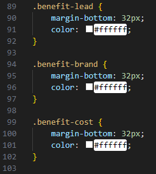

# STUDENTNAME's Horiseon Refactor Feedback
## Grading Breakdown:
<table>
    <tr>
      <td>Overall</td>
      <td style="width:500px">
        <div style='background-color:orange; width:54%; text-align:center'>
          58
        </div>
      </td>
    </tr>
    <tr>
      <td>Deployment</td>
      <td style="width:500px">
        <div style='background-color:green; width:100%; text-align:center'>
          100
        </div>
      </td>
    </tr>
        <tr>
      <td>Technical Acceptance Criteria</td>
      <td style="width:500px">
        <div style='background-color:red; width:29%; text-align:center'>
          29
        </div>
      </td>
    </tr>
        <tr>
      <td>Repository Quality</td>
      <td style="width:500px">
        <div style='background-color:red; width:15%; text-align:center'>
          15
        </div>
      </td>
    </tr>
      <tr>
      <td>Application Quality</td>
      <td style="width:500px">
        <div style='background-color:yellow; width:66%; text-align:center'>
          66
        </div>
      </td>
    </tr>
  </table>

## Deployment(32/32):
```
Excellent work submitting both a Working Deployed applicaiton and Github Repository
```


## Technical Acceptance Criteria(14/40):
<h3 style="text-align:left">Semantic HTML(0/5):</h3>

In this Module, we are recognizing the importance of Semantic Tags. They help the search engines and other user devices to determine the importance and context of web pages. The pages made with semantic elements are much easier to read. It has greater accessibility. It offers a better user experience. Replacing the `div`  elements with a [Semantic Tag](https://www.w3schools.com/html/html5_semantic_elements.asp) is one of the main goals of this Module.

<h4>Feedback for your application:</h4>

```
Index.html line 11: instead of a div tag, maybe a header element
Index.html line 13: instead of a section tag, maybe a nav element
Index.html line 28: instead of a div tag, maybe a main element
Index.html line 29,36,43: instead of a div tag, maybe a section tag
Index.html line 51: instead of a div tag, maybe an aside
Index.html line 52,59,66 instead of a div tag, maybe a section tag
Index html line 74:instead of a div tag, maybe a footer tag
```

<h3 style="text-align:left">HTML Stucture(5/5):</h3>

This Module introduced us to the Hyper Text Markup Languague(HTML). When Creating HTML Files, you must follow a specific structure in order to have a HTML file. [Here](https://www.w3schools.com/html/html_intro.asp) you can find the documentation to creating the strucutre of an HTML Page. You may also use an emmit tag of ```!``` to create the base layout of an HTML page in VS Code.

<h4>Feedback for your application:</h4>

```
Excellent Job Maintaining the Strucutural Integrity of the HTML page.
```

<h3 style="text-align:left">Alt Attributes(0/5):</h3>

In order to continue on the theme of improving Accesiblity, using Alt Attributes on images allows the user to view the text, in case the image is not availabe. 

<h4>Feedback for your application:</h4>

```
Currently, there is no images with an alt attribute, here is how to do it:


```

<h3 style="text-align:left">Heading Attributes(5/5):</h3>

Heading attributes `h1 h2 h3 h4 h5 h6` are essentially a way of granting importance in heading tag. Largely the degree of importance is determined by the developer, but there are [conventions](https://www.w3.org/WAI/tutorials/page-structure/headings/), and following them allow for the improvement of accesibilty.

<h4>Feedback for your application:</h4>

```
Excellent job maintaining a logical heading strucutre
```

<h3 style="text-align:left">Title Element(0/5):</h3>

The Title Element is the text you see in the tab of the window. It is as it states, the Title of the page. Having a Title that reflects your page, allows it to be found more easily when several tabs are open.

<h4>Feedback for your application:</h4>

</img>

```
The title element has a generic "website". 
Update that to something reflecting the application
```

<h3 style="text-align:left">Navigation Links(4/5):</h3>

Navigation links are very usefull tools in order to help the user navigate to different sections of the page, or as we will learn later, to different pages entirely. In this activity we utilize an `href` for each of the `a` tags in the nav bar. These `href`'s correspond to different id's on the page. When the user clicks on the `a` tag, they will navigate to the corresponding element that has that same id.

<h4>Feedback for your application:</h4>

</img>

```
Sometimes collapsing the div tags(see where the green arrow is pointing) is helpful.
line 29 is missing the id that the corresponding link is trying to reference
```

<h3 style="text-align:left">CSS Consolidation (0/5):</h3>

Continuing on the theme of Refactoring Code, Often Times when writing CSS, you may notice that a lot of the code that you have written is duplicates. Say for example, you apply the same style to multiple elements. Consolidating your CSS, is all about cleaning it up to keep your application DRY(Don't Repeat Yourself). The concept of a class in CSS, is something that applies to multiple elements. If you have a style that you want to apply to multiple elements, the convention is to create 1 class for that style, and then apply that class to multiple elements of the page.


<h4>Feedback for your application:</h4>

</img>

```
Notice how there are 3 classes, all with the same styles.
You are going to want to update this by combining all of these into 1 class.
Take that class name, and update the HTML file, so that all these 3 are replaced.
Repeat this same process for the remaining duplicate elements.
```

<h3 style="text-align:left">CSS Comments (0/5):</h3>

Comments in your code are extreemly important. They allow users to be able to quickly READ what is happening in your code. The better the comments, the easier it is to read. In the CSS, if you have 1 file that has all the styles, breaking down the elements into sections is very helpful. If you organize the CSS, you can then use Comments in order to highlight those sections.

<h4>Feedback for your application:</h4>

```
Currently there are no comments present in the CSS.
After you have completed consolidating, Organize the CSS file.
Then add comments to highlight the different sections of the page.
Examples: Footer, Header, Aside, Main Section
```

## Repository Quality (2/13):

 It is important to showcase a good repository, just as it is important to have good code in that repository. There are conventions to follow, and the more outstanding the Repo looks, the better it reflects on the application.

<h4>Repo's Name: 0/2</h4>

```
Avoid using terms like Challenge/Module/Homework #.
Instead name the repo something that correlates to the actual application
```

<h4>File Structure: 0/2</h4>

[Removing Node Modules](https://stackoverflow.com/questions/50675829/remove-node-modules-from-git-in-vscode)

```
Currently your application has the node_modules present.
It is great that you have a gitignore, but check the above link to help remove them from the repo.
```

<h4>Quality Comments: 0/2</h4>

```
Make sure to add comments throughout the code
```

<h4>Commit Messages: 0/2</h4>

 You want to have a descriptive and extensive commit history. They are great for “save points” in your code, not only in case something broke at some point and you have a way to reference it, but also you can look back and read your thought process on how you did things(and future employers can as well).

 ```
  Currently there are very few commits. 
  As you complete a task, become accustomed to adding a commit. 
 ```

<h4>Quality README: 2/5</h4>

The README is essentially the Advertisement and Information Page for your application. You want to showcase the application, and give the necessary information for a user to be able to operate the application. The more appealing the README, the more likely a user will want to use the application.

```
Currently you have a description in the README, which is great.
Make sure to add a screenshot, as well as a Link to the Deployed application.
```

## Application Quality (10/15):

When refactoring the application, it is important to make sure that the application looks the same as it did before we worked on it(unless told otherwise). 

<h4>Feedback for your application:</h4>

<div style="width:100%" >
</img> </img></div>


```
Currently the navigation looks a bit different than it did originally.
You are targeting a div that is inside the class header in the CSS for these 3 styles.
There is currently no div inside of the header class on line 11.
You have changed that to a section tag.
Changing an element/class/id in either the CSS or HTMl, will require consistancy in the other file.
```

## Final Thoughts

```
It definetly looks like there was a bit of a struggle getting started with this activity.
Understanding these concepts take time as well as resources.
Make sure to utilize all the resources at your disposal:
Instructional Staff, Ask BCS, Slack, Other Students, and Tutors(when applicable)
You can do it!
Sincerely,
AJA (Central Grading)
```
